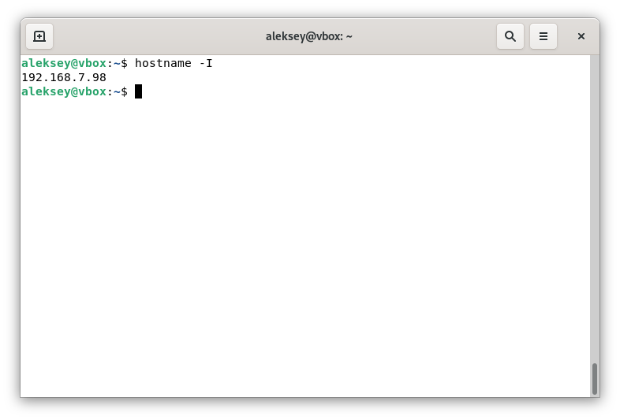

# Задание 1

На лекции рассматривались режимы репликации master-slave, master-master, опишите их различия.

Ответить в свободной форме.

Режимы репликации master-slave и master-master — это два разных способа организации копирования данных между серверами баз данных.

В режиме master-slave (ведущий-ведомый) есть один основной сервер — master, на котором происходят все изменения (запись, обновление, удаление данных). Все остальные серверы — slaves — только копируют эти изменения и обычно используются только для чтения. То есть запись возможна только на master, а slave-серверы помогают распределить нагрузку при чтении или служат резервной копией. Если master выйдет из строя, придётся вручную переключаться на один из slave-серверов.

В режиме master-master (ведущий-ведущий) уже оба сервера могут принимать и запись, и чтение. То есть каждый из них является и master, и slave одновременно: изменения, сделанные на одном сервере, автоматически копируются на другой и наоборот. Это даёт больше гибкости и отказоустойчивости, потому что если один сервер упадёт, второй может продолжать работать без остановки. Но такой режим сложнее настраивать и может привести к конфликтам, например, если на обоих серверах одновременно изменить одну и ту же запись.

Короче говоря, master-slave проще и безопаснее, а master-master мощнее, но сложнее и рискованнее.

# Задание 2

